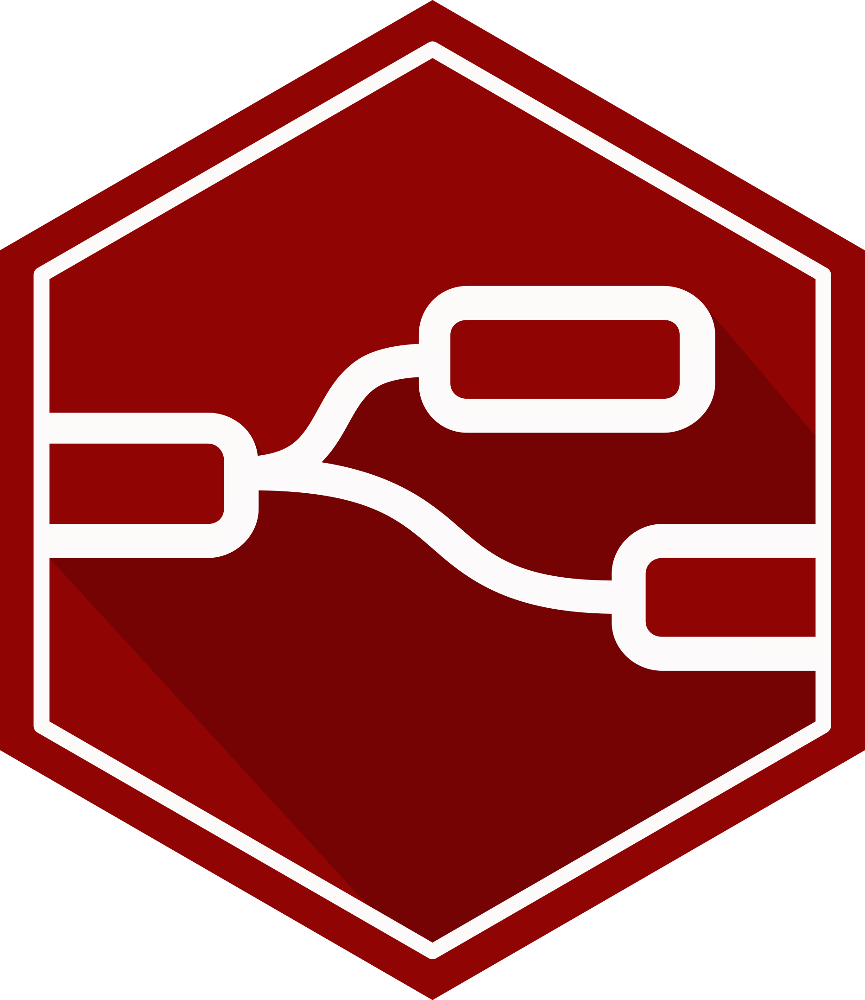
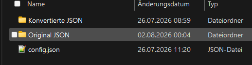
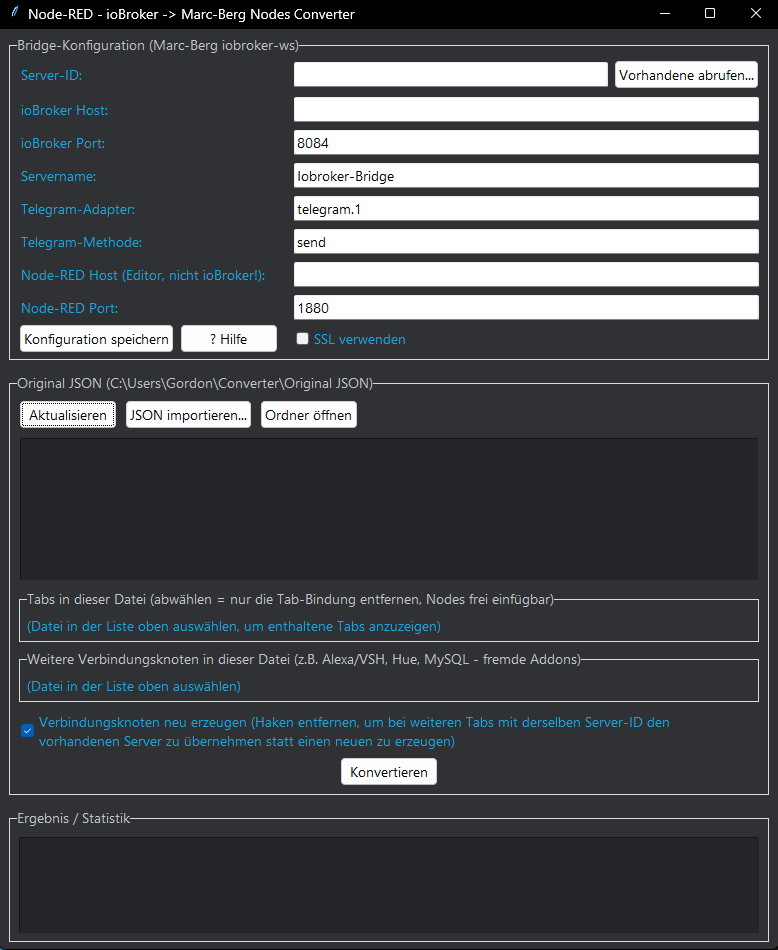

🌍 Sprachen: [🇺🇸 English](https://github.com/Dreamdancer100/NodeRed-Converter/blob/main/README.md) | [🇩🇪 Deutsch](https://github.com/Dreamdancer100/NodeRed-Converter/blob/main/README.de.md#)

<div align="center">



# NodeRed-Converter #

### ioBroker → Marc-Berg Node-RED Konverter · Windows-GUI

*Wandelt Node-RED-Flows, die mit den Standard-Nodes von ioBroker gebaut wurden, in Marc Bergs natives WebSocket-Node-Format um — ein Klick, fertig.* ⚡


</div>

---

## ✨ Was es macht

Wenn du **Node-RED als Adapter *innerhalb* von ioBroker** betreibst, nutzen deine Flows die eingebauten `node-red-contrib-iobroker`-Nodes. Sobald Node-RED aber **eigenständig** läuft (eigene VM / LXC / Docker) und über **WebSocket** mit ioBroker spricht, brauchst du **Marc Bergs externe Nodes** ([`Marc-Berg/node-red-contrib-iobroker`](https://github.com/Marc-Berg/node-red-contrib-iobroker)).

**NodeRed-Converter** nimmt eine exportierte Flow-`.json` und schreibt sie automatisch in genau dieses native WebSocket-Format um — inklusive eines passenden `iob-config`-Verbindungs-Nodes. 🔁

### 🔀 Node-Zuordnung

| ioBroker-Node | ➜ | Marc-Berg-Node |
|:---|:---:|:---|
| `ioBroker in`     | ➜ | `iobin` |
| `ioBroker get`    | ➜ | `iobget` |
| `ioBroker out`    | ➜ | `iobout` |
| `ioBroker sendTo` | ➜ | `iobsendto` |

➕ Ein passender **`iob-config`**-Verbindungs-Node wird automatisch hinzugefügt.

---

## 📦 Installation

1. ⬇️ Lade **`NodeRed-Converter.exe`** (kompletter Installer) aus den [Releases](../../releases) herunter.
2. 🖱️ Ausführen — einfach das Programm installieren.
3. 🔗 Du bekommst eine **Desktop-Verknüpfung**. Klick drauf und das Programm öffnet sich.

### 🗂️ Erster Start — automatisch angelegte Ordner & Config

Beim **ersten Start** legt das Programm die beiden Ordner und die Config-Datei automatisch an:

```
C:\Users\<DeinName>\Converter\
├── 📁 Original JSON\        ← hier deine Quell-Flows ablegen
├── 📁 Konvertierte JSON\    ← hier landen die Ergebnisse
└── 📄 config.json           ← deine gespeicherten Bridge-Einstellungen
```

> ✅ Kein manuelles Einrichten — es erscheint einfach von selbst.

<div align="center">

<br><em>Angelegte Ordner & Config-Datei</em>
</div>

---

## ⚙️ Konfiguration (einmalig)

Oben im Fenster trägst du die **Bridge-Konfiguration** einmal ein und klickst auf **„Konfiguration speichern"**. Diese Werte werden in der `config.json` gespeichert und für jede weitere Konvertierung wiederverwendet.

| Feld | Bedeutung |
|:---|:---|
| 🆔 **Server-ID** | ⚠️ **Kein** frei wählbarer Name — es muss die **exakte interne Node-RED-ID** des Ziel-Config-Nodes sein (z. B. `a1b2c3d4e5f6…`). Nutze den Button **„Vorhandene abrufen…"**, um sie automatisch zu holen, statt zu raten. |
| 🖥️ **ioBroker Host** | IP oder Hostname deines ioBroker-Servers. |
| 🔌 **ioBroker Port** | Port der ioBroker-**Admin-Adapter**-Instanz, die für die Node-RED-Bridge genutzt wird. |
| 🏷️ **Servername** | Anzeigename der Verbindung im Node-RED-Editor. |
| 🔒 **SSL verwenden** | Aktivieren, wenn dein Admin-Adapter über **HTTPS / WSS** läuft. |
| 💬 **Telegram-Adapter / Methode** | Nur relevant, wenn dein Flow `ioBroker sendTo` für Telegram nutzt (z. B. `telegram.1` / `send`). |
| 🌐 **Node-RED Host / Port** | Der **Node-RED-Editor** selbst (Standard-Port `1880`) — **nicht** die ioBroker-Admin-Instanz. Wird nur für den Button *„Vorhandene abrufen…"* gebraucht. |

<div align="center">

<br><em>Programmansicht</em>
</div>

---

## 🚀 Benutzung

1. 📥 Klick auf **„JSON importieren…"** und wähle eine oder mehrere `flows.json`-Dateien (oder exportierte Tabs als JSON). Sie werden automatisch nach **Original JSON** kopiert.
   *Alternativ:* Dateien manuell in den Ordner legen und **„Aktualisieren"** drücken.
2. 🖱️ Datei in der Liste auswählen, dann auf **„Konvertieren"** klicken.
3. ✅ Das Ergebnis wird als **`<name>_Neu.json`** in **Konvertierte JSON** geschrieben.
4. 📊 Das untere Feld zeigt die **Statistik** — wie viele `iobin` / `iobget` / `iobout` / `iobsendto`-Nodes erzeugt wurden, plus **Warnungen** (z. B. `DEADBAND`-Nodes, die sich nicht 1:1 zuordnen lassen).

> ℹ️ Eine `Readme`-Textdatei mit derselben Anleitung liegt im Programmordner — identisch zur eingebauten **Hilfe**.

---

## ⚠️ Hinweise

- **DEADBAND**-Nodes werden in der Statistik markiert, weil sie sich nicht 1:1 übertragen lassen — die bitte manuell prüfen.
- Die **Server-ID** ist der häufigste Fehler. Wenn die neuen Nodes in Node-RED *„No server config"* zeigen, obwohl *„Verbindungs-Node erstellen"* angehakt ist, passt deine Server-ID nicht zu einem echten Config-Node. Nutze **„Vorhandene abrufen…"**.

---

## 💡 Warum ich es gebaut habe

Dieses Programm hat mir *enorm* viel Zeit gespart beim Konvertieren von **79 Flows** — manche mit **96.000 Zeilen** Code. Der Konverter jagt die JSON einmal durch und die Umwandlung ist erledigt. 🎉

*Viel Spaß beim Konvertieren deiner Flows!* 🙌

---

<div align="center">

Mit ❤️ erstellt von **Dreamdancer100**

</div>
